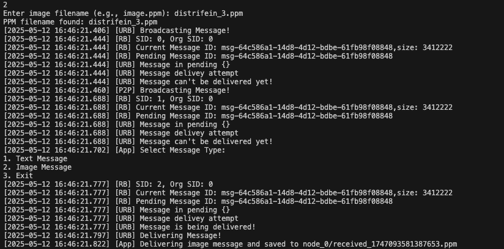
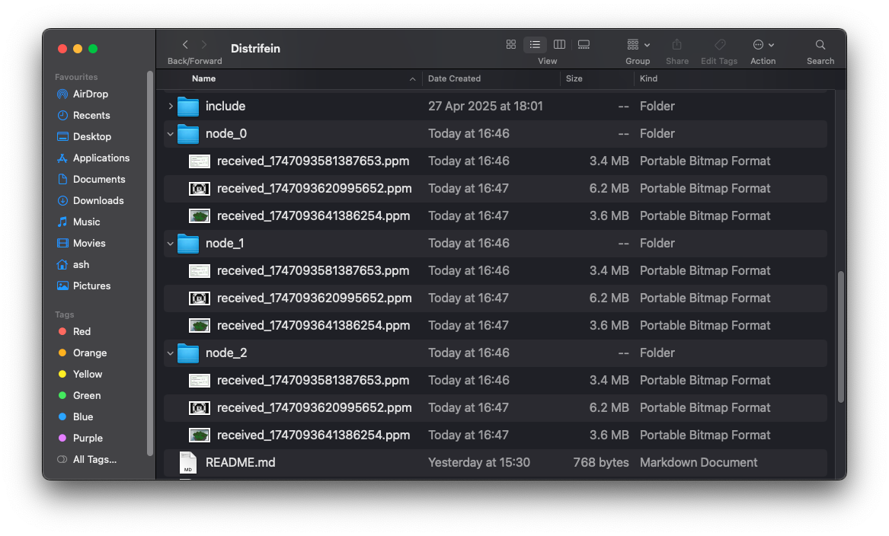
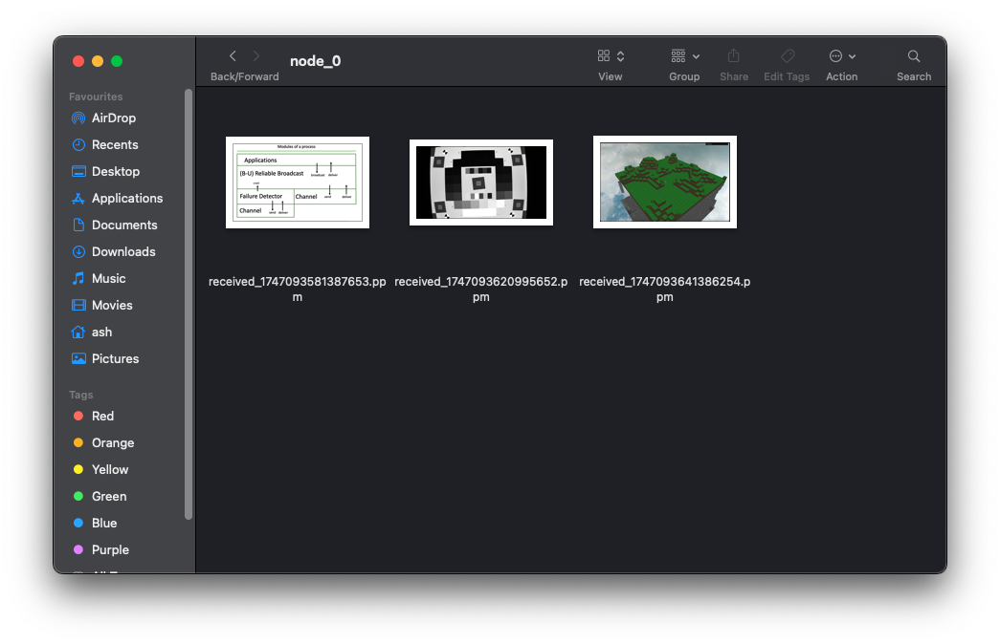

# Distrifein

Distributed, Decentralized, Fault-Tolerant Media Platform in C++

#### Current Features:
- Peer-to-Peer Communication via TCP
- Best Effort Broadcast over Peer-to-Peer layer
- Failure Detector using heartbeat-based method
- Support for broadcasting text, images(ppm currently supported)
- Event-driven intra-layer communication with modular layered architecture with recursive mutexes
- Reliable Broadcast
- Uniform Reliable Broadcast

#### Build Instructions

1. Clone the repository with:
```
git clone https://github.com/ashwanirathee/distrifein.git
```

2.Update and add required packages
```
sudo apt update
sudo apt install cmake uuid-dev

# or on mac
brew install cmake ossp-uuid
```

3. Then in root:
```
./build.sh or ./rebuild.sh
```

#### Usage Instructions 
After building, you can run the application with the following command:

```
./build/main 6 3,4 0
```
where `./build/main<node_id> <peer_node_ids_comma_separated> <test_type>` is the command line format. In the root directory, there must be a `peer_list.txt` file that contains the IP addresses and ports of the nodes to connect to.
and it will look like this:
```
#nodeid   #ip        #peer
0         127.0.0.1  3000
1         127.0.0.1  3001
2         127.0.0.1  3002
3         101.0.0.26 8000
4         102.0.0.36 8001
```
This might have your own local ip and ports or the peers in LAN. Multiple nodes/processes can be run on the same machine and can communicate with each other as long as they have different ports. Also there can be multiple nodes on different machines in the same LAN.

#### Example: image transfer via uniform reliable broadcast
Displays the image of the uniform reliable broadcast protocol in action where I specify the file to be sent. It first puts the image in pending for itselfs and then waits for acks from the other nodes to deliver it. SID is the current sender id and Org SID is the original sender id. We wait for acks for all the correct processes to deliver the image before being saved to the disk:



#### Results:
- I had 3 processes running on my local machine, each with a different port number. The processes were able to communicate with each other and transfer images using the uniform reliable broadcast protocol. Each node had a unique ID and a folder to store the images received. The images were transferred successfully which is shown below:




Some Logs are present here: https://gist.github.com/ashwanirathee/c7dcb605a0bfa88e53890b2812e95169 

#### References
This project is greatly influenced by course content from the graduate Distributed Systems class (CSE 232) at UCSC, taught by Prof. Mohsen Lesani.

- Notes: https://mohsenlesani.github.io/slugcse232/ 
