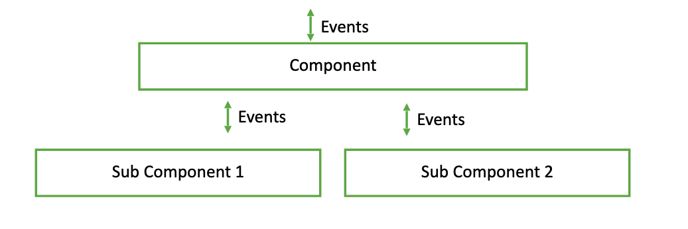

# Distrifein

Distributed, Decentralized, Fault-Tolerant Media Platform in C++

#### Current Features:
- Peer-to-Peer Communication via TCP
- Best Effort Broadcast over Peer-to-Peer layer
- Failure Detector using heartbeat-based method
- Ability to handle custom data (text, images, video); previously only strings were supported
- Event-driven intra-layer communication with modular layered architecture with recursive mutexes
- 
- Reliable Broadcast (Work in Progress)

#### References
This project is greatly influenced by course content from the graduate Distributed Systems class (CSE 232) at UCSC, taught by Prof. Mohsen Lesani.